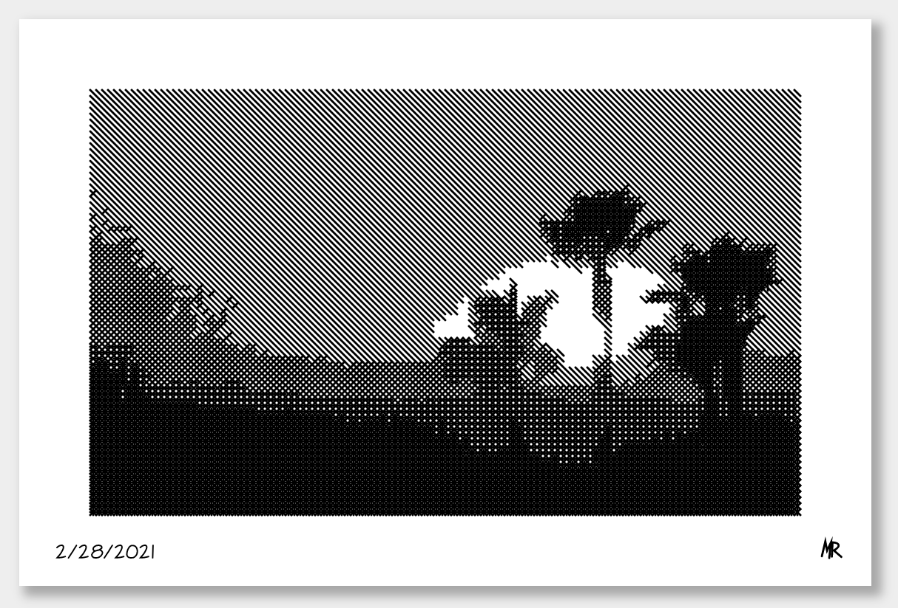
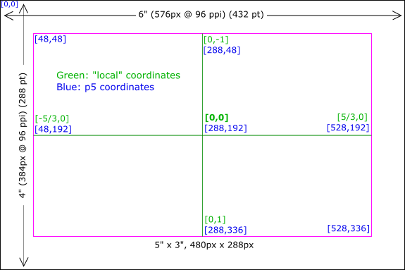

# AxiDraw Drawing Canvas



[Use Now](https://markroland.github.io/axidraw-sketchpad/index.html)

## Dimensions / Format



This project exports drawings to a 6" x 4" SVG file at 96 dpi
suitable to printing on an [AxiDraw MiniKit 2](https://shop.evilmadscientist.com/productsmenu/924).

For the most part, drawings are confined to 5" x 3". This provides margin for adding a title, date
and signature, and the 5:3 proportion works well for even division.

Even though this is based on p5.js, the coordinates for constructing paths is based
around a [0,0] origin point at the center of the canvas. The base unit (1) extends
to the minimum constraint of the drawing canvas, the height. With this layout, the
distance from the origin [0,0] to the top-center of canvas is 1.5 inches.

## Use of P5.js

This uses the [p5.js-svg library](https://github.com/zenozeng/p5.js-svg) to run P5.js in SVG mode.
It uses the [svgcanvas project](https://github.com/zenozeng/svgcanvas), which appears to
require using P5.js in [instance mode](https://github.com/processing/p5.js/wiki/Global-and-instance-mode)
in order to specify where to insert the HTML `<canvas>` element.

- [p5.SVG Basic Examples](http://zenozeng.github.io/p5.js-svg/examples/#basic)

## Run from server

Because this code loads external resources (image and font files), modern browsers will require
it to be run from a local HTTP server, as opposed to running from the file system (i.e. File://).

There are [many great ways to start a local HTTP server](https://gist.github.com/willurd/5720255),
but here is a command for Python 3.

```
python -m http.server
```

## License

At this point I am not formally licensing this code. It's my intent for others to learn from 
and use this code (otherwise I wouldn't share it publicly), but all art generated using this
code as committed into this repository belongs to Mark Roland.
